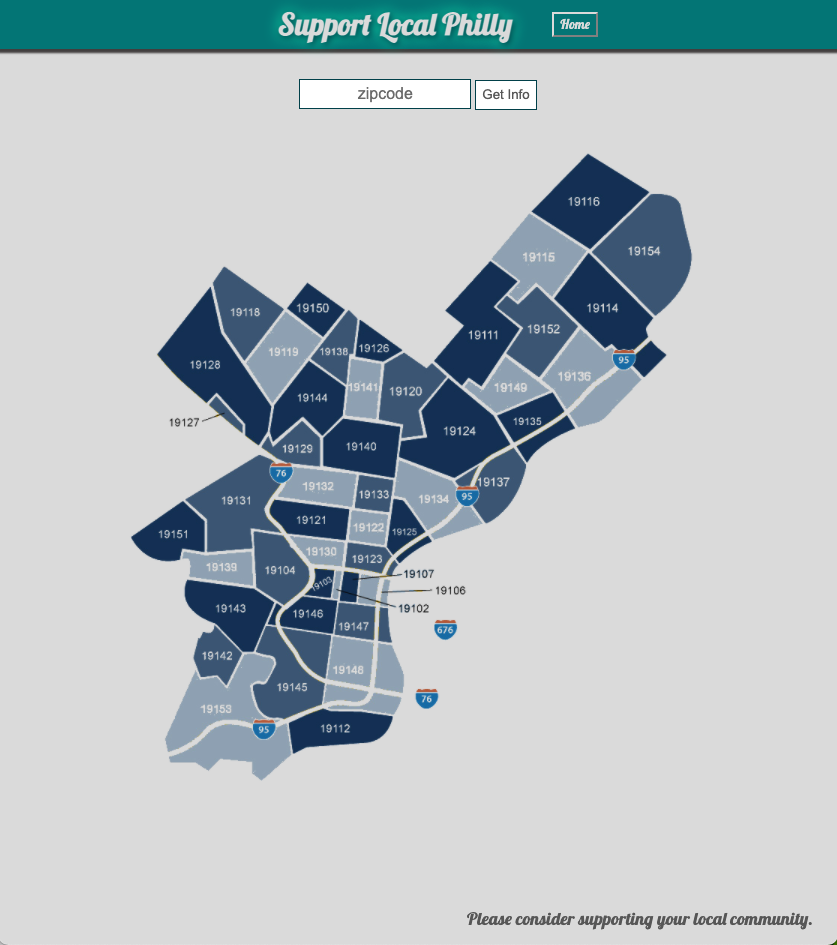
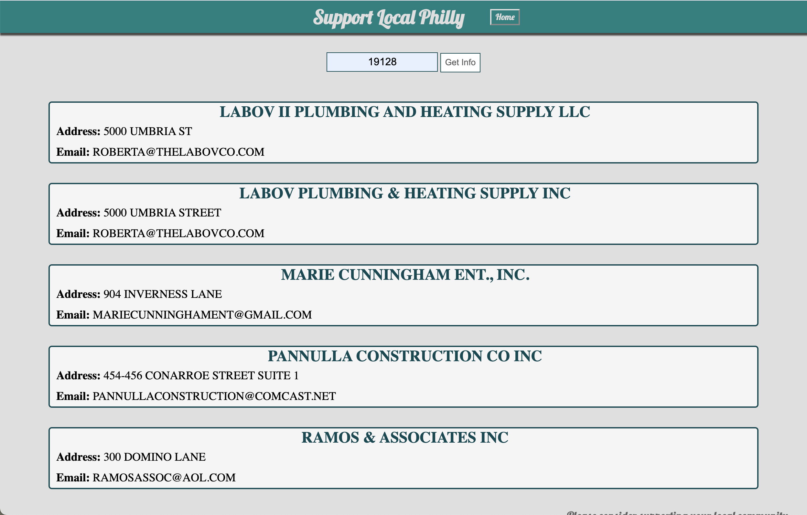
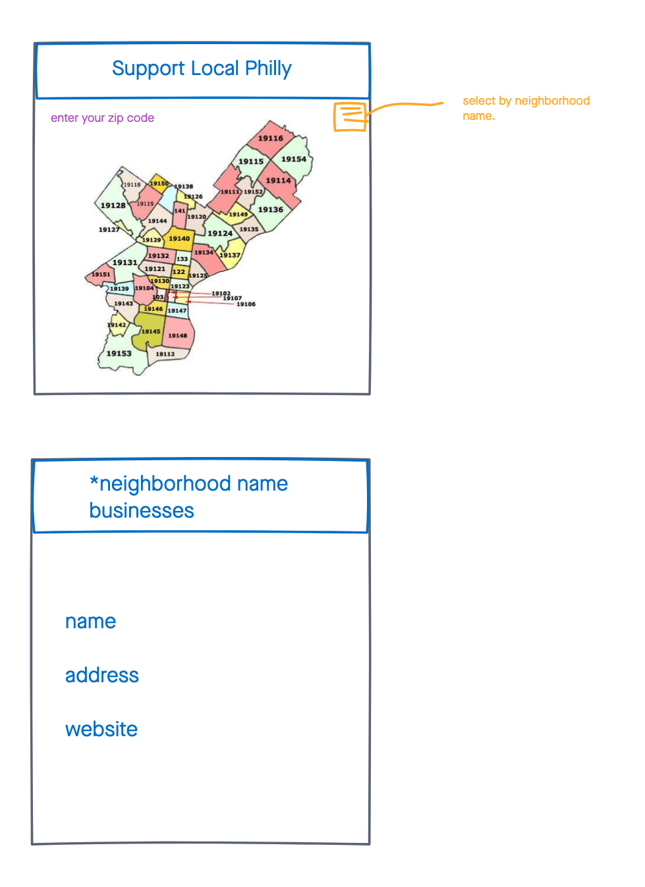

# Support Local Philly 
a simple web app for listing the businesses for the neighborhoods of Philadelphia.

---
## Technologies

- HTML 5
- CSS3 
- JavaScript/jQuery
- [Philadelphia Registered Businesses API](https://phl.carto.com/api/v2/sql?q=SELECT%20*%20FROM%20registered_local_businesses%20ORDER%20BY%20business_name%20ASC)

---

## Screenshots

---
### Wire-frames

### Images 

---

## Getting Started 

[click here](https://caleb88confer.github.io/Support-Local-Philly/) to see the working app

---
## Future Enhancements

add clickability to the map so a user can select based on the visual. 